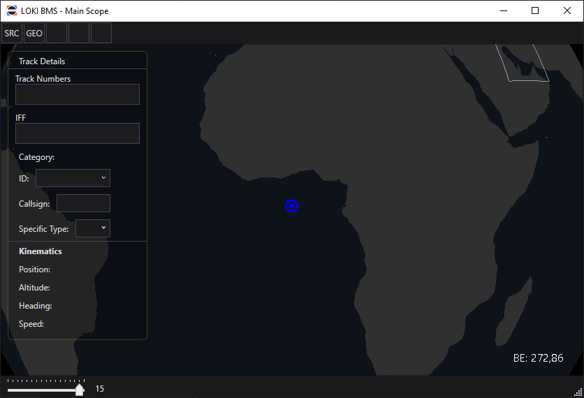

# LOKI BMS
## Overview
LOKI Battle Management System (BMS) is a free, open-source radar scope for use with DCS World. It aims to replicate the tools and styles found in real-world radar scopes.

## Installation
1. Download and extract the files from a Release package, then run "LOKI BMS.exe"
2. The DCS Server you're connecting to must have the [DCS GRPC server](https://github.com/DCS-gRPC) installed and the relevant ports for GRPC opened

## Basic Usage
1. Run "LOKI BMS.exe"
2. Click on the Sources Button (SRC) at the left end of the top row of buttons to open the Sources window
	- 
	1. Use the + button at the bottom left of this window to add a new Data Source
	2. Select the new data source in the list on the left, then edit its details like the web/IP address, port, and polling rates
	3. You can change how the raw data from this server will look on your scope using the Symbology pane on the right
	4. To activate a source, check the "Active" box near the top of the Source Details pane
		- Data Sources will automatically attempt to reconnect if they are unable to connect or lose the connection (often due to the mission restarting). By default, DataSources will attempt to connect 5 times, with a 5 second delay after a connection failure. This behavior can be adjusted in the `DataSources.xml` file as of 23 Nov 2022.
	- Data Sources will remember if they were active or not when you closed the application, allowing them to automatically connect when you start the application!
	- Data sources are stored in `%AppData%/Loki-BMS/DataSources.xml`
3. Click on the Geometry button (GEO) in the top row of buttons to import and customize KML files that will be displayed on the scope
	- 
	1. Click "Import" to open a file browser that will let you locate and load in KML files (you can select multiple!)
	2. Select the geometry you want to adjust from the list on the left in order to rename it, change its stroke and fill colors, or remove it from the list
	3. A geometry can be made invisible without removing it by toggling the checkbox next to its name in the list
	- Geometry **will** persist through application close/reopen
	- Geometry *should* import colors from the source KML

### Main Scope View
- The Main Scope's view is determined by a central view position and a vertical field of view
	- At the bottom left of the scope is an incremented slider, representing the logarithmically-scaling vertical field of view (acceptable values are all real numbers from 0-16)
	- The zoom level can be incremented by using the scroll wheel or touchpad's scroll function (this increments the zoom by 1.0)
- Zoom Presets are available through the number keys 1 through 0
	- Press and hold the button for 0.75 seconds or more to **SET** a zoom preset
	- Press and release the same button quickly to **RECALL** a zoom preset
	- Zoom presets store the view position and zoom level
- Rubber band zoom, a concept that may be familiar to real-world controllers, is not implemented as of 23 Nov 2022.
- Zoom presets and the current view are persistent through application close/reopen
	- These presets and the current view position are stored in `%AppData%/Loki-BMS/Views.xml`

### Track Details
- By default, Tracks will display their altitude in hundreds of feet in the tags to their lower right
-  
- Click on a track on-screen to select it and view its details
	- The currently selected track will be highlighted with a light gray ring
- Viewable Details as of 23 Nov 2022
	- Track Numbers (Internal to LOKI and External, from DCS)
	- IFF Table - **currently blank,** pending SRS integration
	- Category (air/sea/land/other)
	- ID (Friend/AssumedFriend/Neutral/Suspect/Hostile/Unknown/Pending)
	- Callsign
	- Specific Type (changes the track's symbol on the scope)
	- Kinematic details
- If multiple tracks are visually stacked, you can click multiple times on the stack to iterate through the tracks at that point

### Bullseye and Measurement Tools
- 
- By default, the Bullseye will be at 0 North, 0 East (null island)
	- Clicking "Use Bullseye" in the Sources Window will move the Bullseye to that server's BlueFor bullseye position
	- This behavior is temporary, but current as of 23 Nov 2022
- The "BE" field at the bottom right of the screen will show the Mouse cursor's bearing and range from Bullseye in degrees and Nautical Miles, computed via Great Circle distance
- 
- Clicking anywhere on the scope (except on the Track Details pane) and dragging will draw a measure line, displaying the mouse cursor's position relative to the initial click point